# Version Control Systems, Git, and GitHub

## Table of Contents
1. [Introduction to Version Control Systems](#introduction-to-version-control-systems)
2. [What is Git?](#what-is-git)
3. [Git Fundamentals](#git-fundamentals)
4. [Git Workflow](#git-workflow)
5. [Branching and Merging](#branching-and-merging)
6. [Remote Repositories and GitHub](#remote-repositories-and-github)
7. [Common Git Commands](#common-git-commands)
8. [Best Practices](#best-practices)
9. [GitHub Features](#github-features)
10. [Git Workflow Examples](#git-workflow-examples)

## Introduction to Version Control Systems

A **Version Control System (VCS)** is a tool that helps you manage changes to files over time. It allows you to:
- Track changes to your code
- Collaborate with other developers
- Revert to previous versions
- Create branches for different features
- Merge changes from multiple contributors

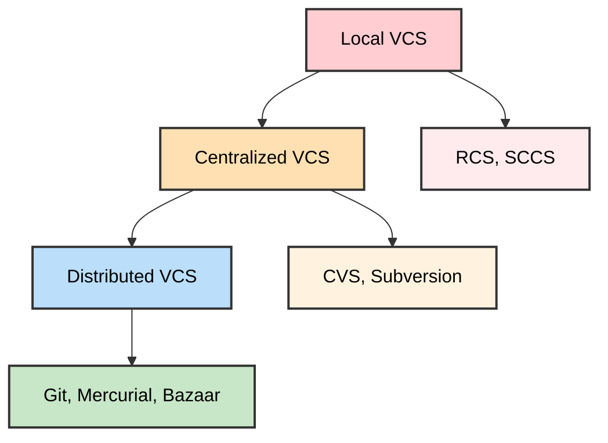

### Types of Version Control Systems

1. **Local Version Control Systems**
   - Store changes in a local database
   - Example: RCS (Revision Control System)

2. **Centralized Version Control Systems**
   - Single server contains all versioned files
   - Examples: CVS, Subversion (SVN)

3. **Distributed Version Control Systems**
   - Every user has a complete copy of the project history
   - Examples: Git, Mercurial, Bazaar

## What is Git?

**Git** is a distributed version control system created by Linus Torvalds in 2005. It's designed to handle everything from small to very large projects with speed and efficiency.

### Key Features of Git:
- **Distributed**: Every clone is a full backup
- **Fast**: Local operations are lightning fast
- **Data Integrity**: Everything is checksummed
- **Branching**: Lightweight branching and merging
- **Staging Area**: Intermediate area for preparing commits

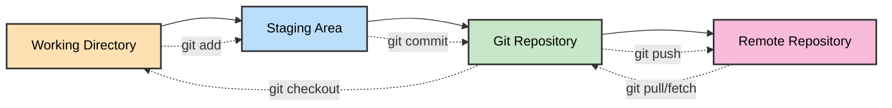

## Git Fundamentals

### The Three States
Git has three main states that your files can reside in:

1. **Modified**: Changed but not committed to database
2. **Staged**: Marked to go into next commit snapshot
3. **Committed**: Safely stored in local database

### Git Areas
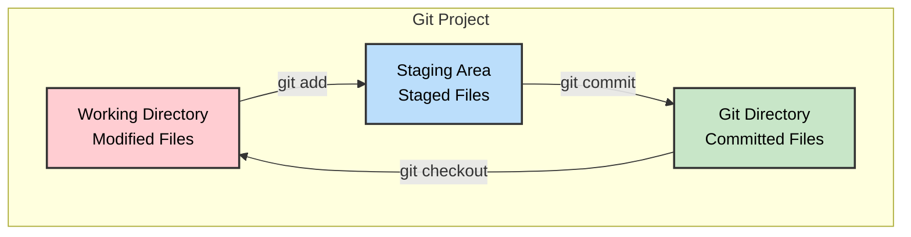

### Git Object Types

Git stores four types of objects:

1. **Blob**: File content
2. **Tree**: Directory structure
3. **Commit**: Snapshot with metadata
4. **Tag**: Named reference to a commit

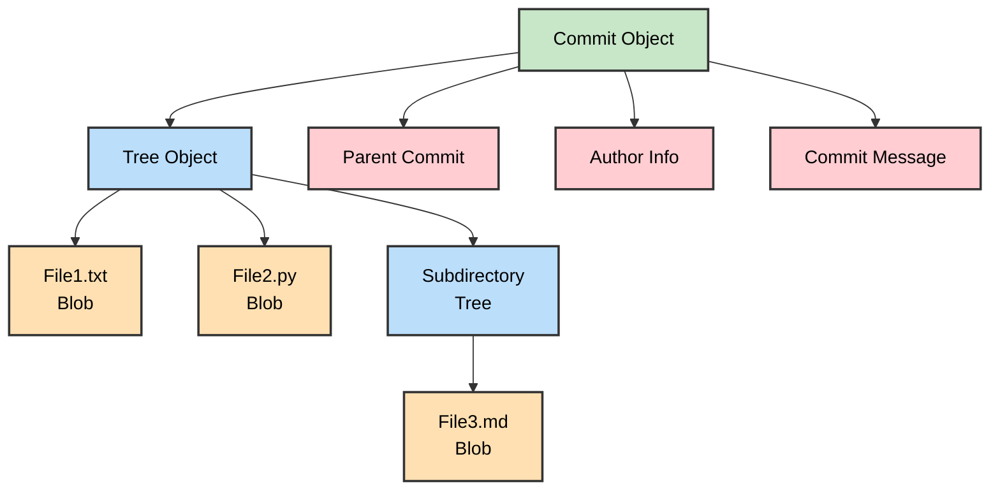

## Git Workflow

### Basic Git Workflow

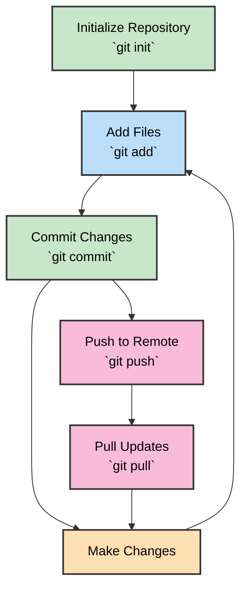

### Detailed Workflow Steps

1. **Initialize**: Create a new Git repository
2. **Add**: Stage changes for commit
3. **Commit**: Save changes to local repository
4. **Push**: Upload changes to remote repository
5. **Pull**: Download changes from remote repository
6. **Merge**: Combine different branches

## Branching and Merging

### What is Branching?

Branching allows you to diverge from the main line of development and work on features independently.

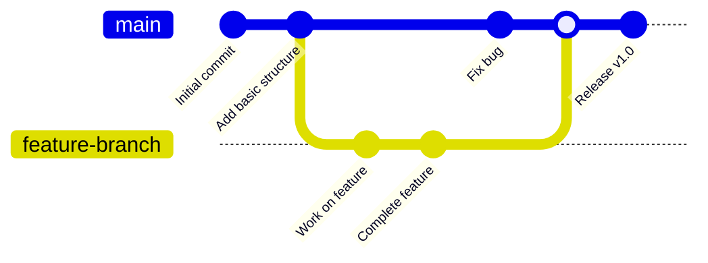

### Branch Types

1. **Main/Master**: Primary development branch
2. **Feature Branches**: For developing new features
3. **Hotfix Branches**: For critical bug fixes
4. **Release Branches**: For preparing releases

### Git Flow Model

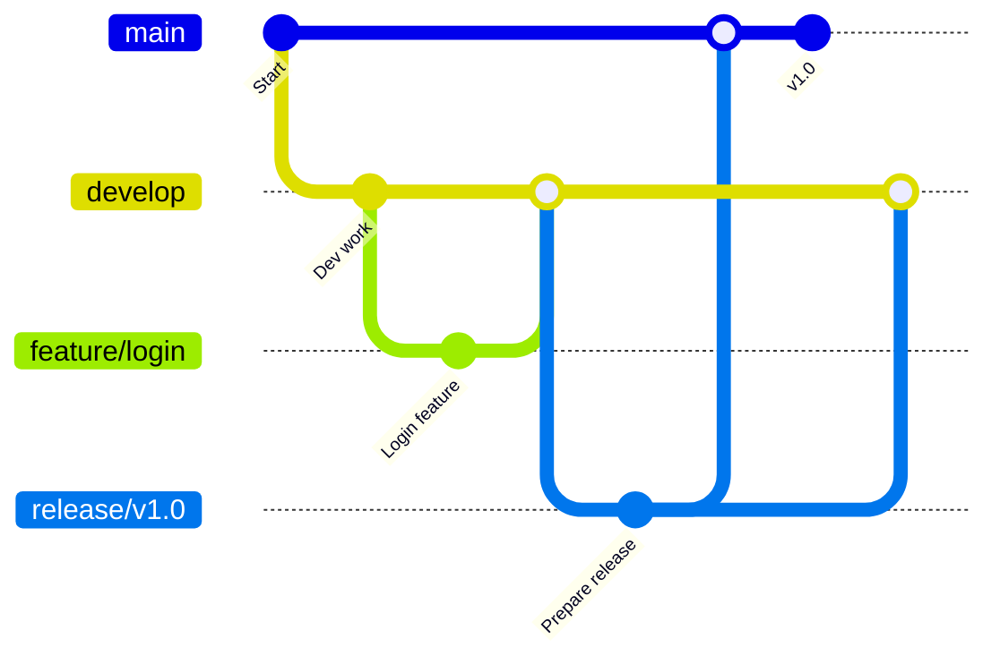

## Remote Repositories and GitHub

### What is GitHub?

**GitHub** is a web-based hosting service for Git repositories. It provides:
- Repository hosting
- Collaboration tools
- Issue tracking
- Pull requests
- Project management
- CI/CD integration

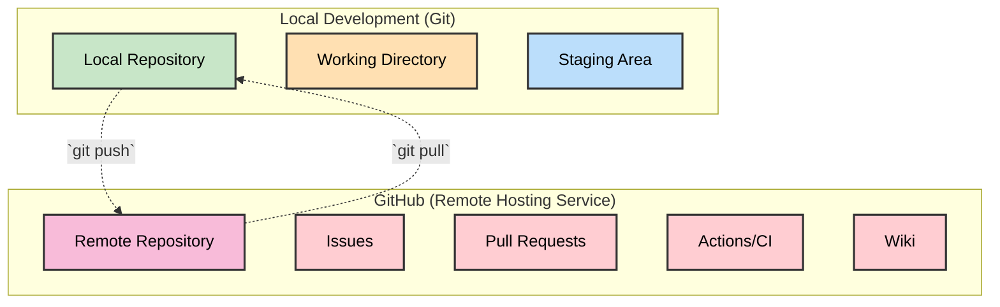

### Repository Operations

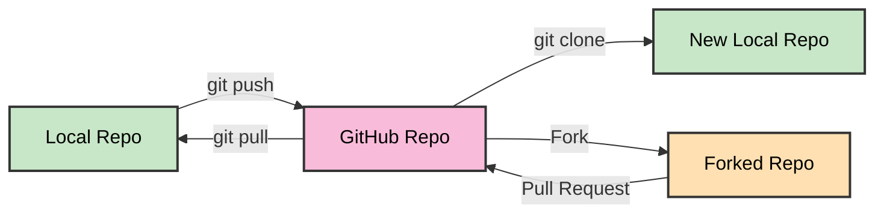

## Common Git Commands

### Repository Setup
```bash
# Initialize a new repository
git init

# Clone an existing repository
git clone <repository-url>

# Add remote repository
git remote add origin <repository-url>
```

### Basic Operations
```bash
# Check status
git status

# Add files to staging area
git add <file>
git add .  # Add all files

# Commit changes
git commit -m "Commit message"

# Push to remote repository
git push origin main

# Pull from remote repository
git pull origin main
```

### Branching Commands
```bash
# List branches
git branch

# Create new branch
git branch <branch-name>

# Switch to branch
git checkout <branch-name>

# Create and switch to new branch
git checkout -b <branch-name>

# Merge branch
git merge <branch-name>

# Delete branch
git branch -d <branch-name>
```

### History and Logs
```bash
# View commit history
git log

# View compact history
git log --oneline

# View changes
git diff

# View staged changes
git diff --staged
```

## Best Practices

### Commit Messages
- Use present tense ("Add feature" not "Added feature")
- Keep first line under 50 characters
- Use imperative mood
- Be descriptive but concise

```
Good commit messages:
✓ Add user authentication system
✓ Fix memory leak in data processor
✓ Update README with installation instructions

Bad commit messages:
✗ Fixed stuff
✗ Working on it
✗ asdfgh
```

### Branching Strategy

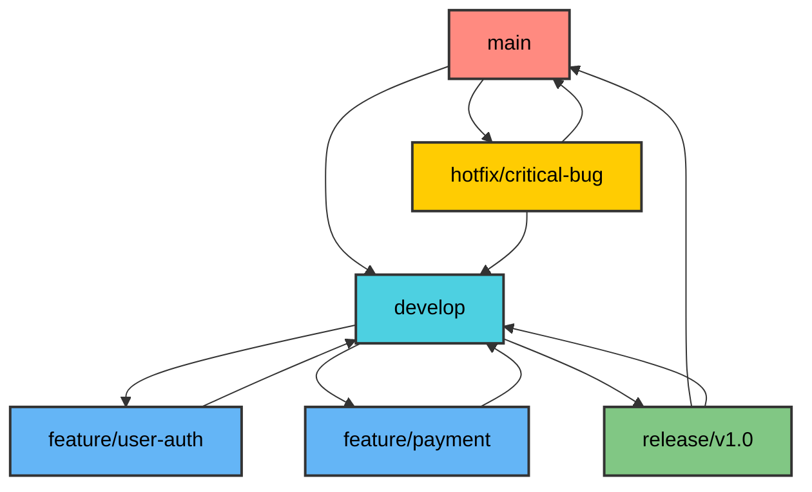

### Repository Structure
```
project/
├── .gitignore          # Files to ignore
├── README.md           # Project documentation
├── LICENSE            # License file
├── requirements.txt   # Dependencies (Python)
├── src/              # Source code
├── tests/            # Test files
├── docs/             # Documentation
└── .github/          # GitHub workflows
```

## GitHub Features

### Pull Requests
A pull request is a way to propose changes to a repository.

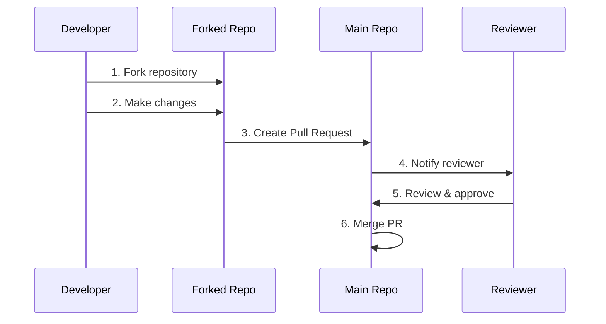

### Issues and Project Management
- **Issues**: Track bugs and feature requests
- **Milestones**: Group issues by goals
- **Projects**: Kanban-style project boards
- **Labels**: Categorize issues and PRs

### GitHub Actions (CI/CD)
Automate workflows with GitHub Actions:

```yaml
name: Python Tests
on: [push, pull_request]
jobs:
  test:
    runs-on: ubuntu-latest
    steps:
    - uses: actions/checkout@v2
    - name: Set up Python
      uses: actions/setup-python@v2
      with:
        python-version: 3.9
    - name: Install dependencies
      run: pip install -r requirements.txt
    - name: Run tests
      run: pytest
```

## Git Workflow Examples

### Feature Development Workflow

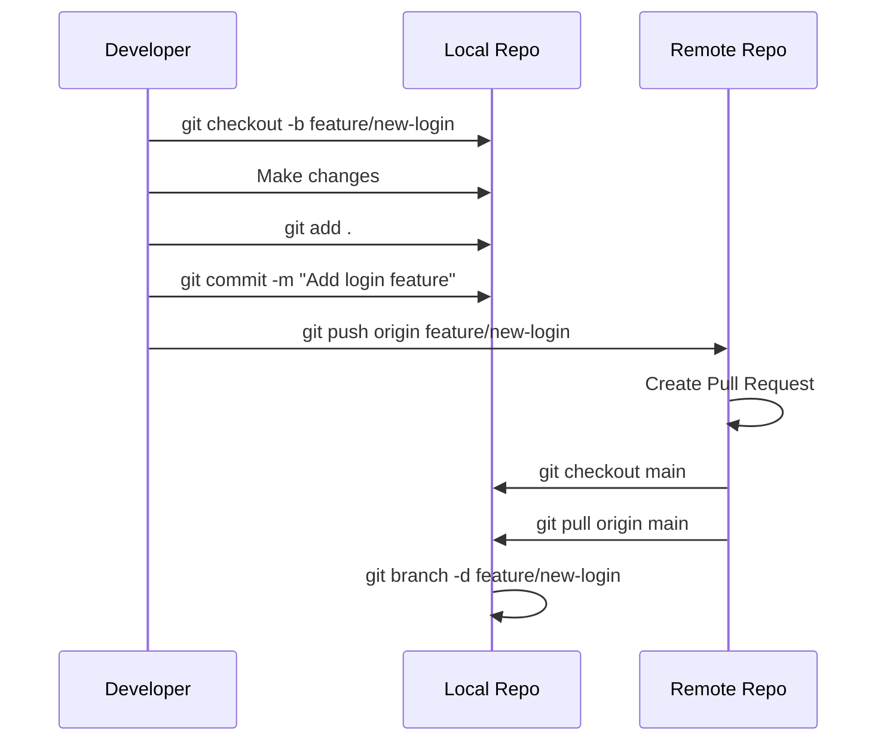

### Collaboration Workflow

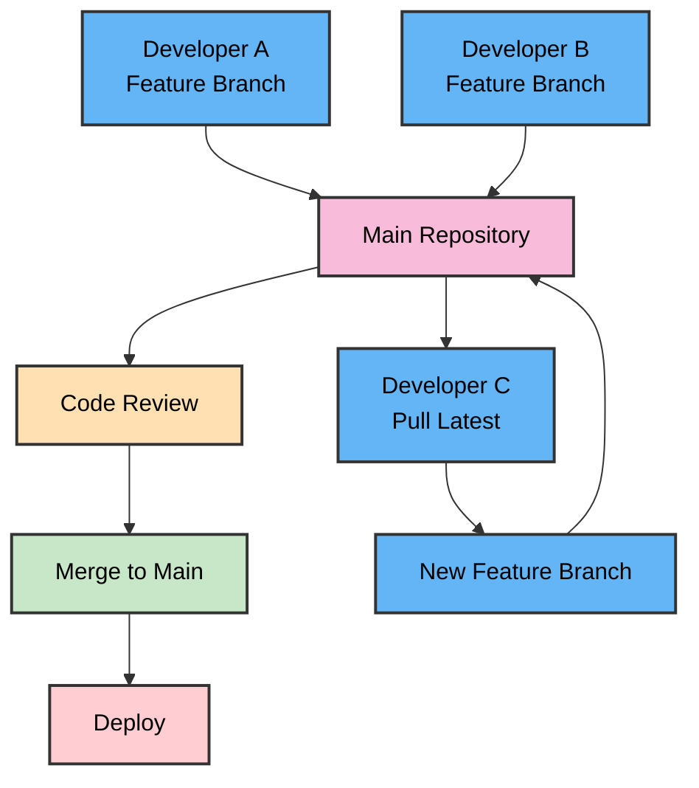

## Troubleshooting Common Issues

### Merge Conflicts
When Git can't automatically merge changes:

```bash
# See conflicted files
git status

# Edit files to resolve conflicts
# Look for conflict markers: <<<<<<< ======= >>>>>>>

# Add resolved files
git add <resolved-file>

# Complete the merge
git commit
```

### Undoing Changes
```bash
# Unstage files
git reset HEAD <file>

# Discard local changes
git checkout -- <file>

# Undo last commit (keep changes)
git reset --soft HEAD^

# Undo last commit (discard changes)
git reset --hard HEAD^
```

### Working with Remotes
```bash
# View remote repositories
git remote -v

# Add remote
git remote add upstream <url>

# Fetch from remote
git fetch origin

# Push to different remote
git push upstream main
```

---

## Summary

Version Control Systems, particularly Git and GitHub, are essential tools for modern software development. They provide:

- **History Tracking**: Complete history of all changes
- **Collaboration**: Multiple developers working together
- **Branching**: Parallel development of features
- **Backup**: Distributed copies of your code
- **Integration**: CI/CD and project management tools

Understanding these tools is crucial for any developer, whether working alone or in a team. Start with basic commands and gradually learn more advanced features as needed.

### Key Takeaways
1. Always commit frequently with meaningful messages
2. Use branches for features and experiments
3. Keep your main branch stable
4. Review code through pull requests
5. Use `.gitignore` to exclude unnecessary files
6. Document your project with good README files
7. Follow consistent naming conventions
8. Backup important work by pushing to remote repositories
