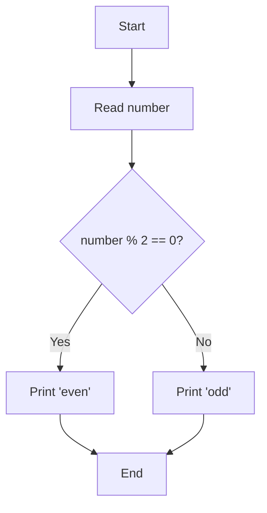
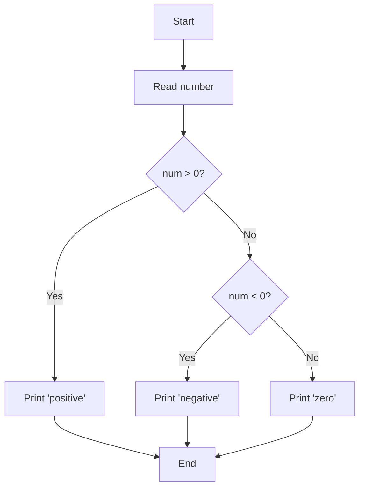
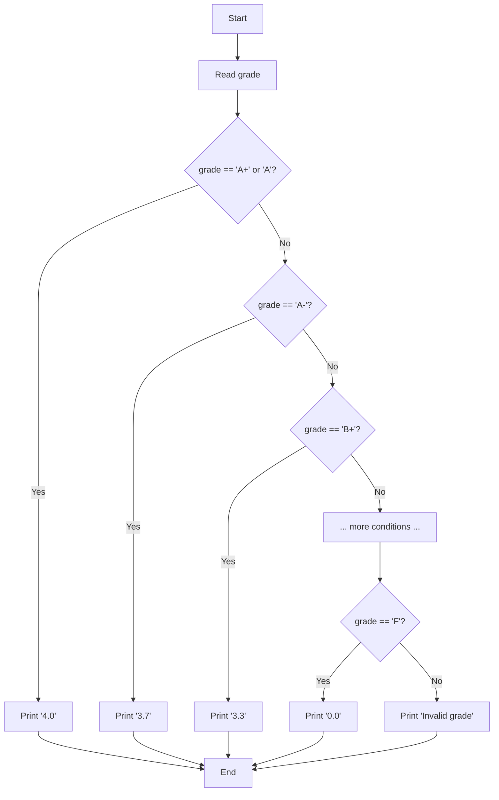
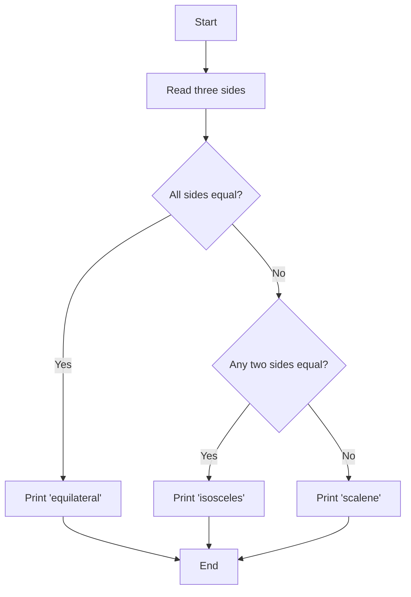
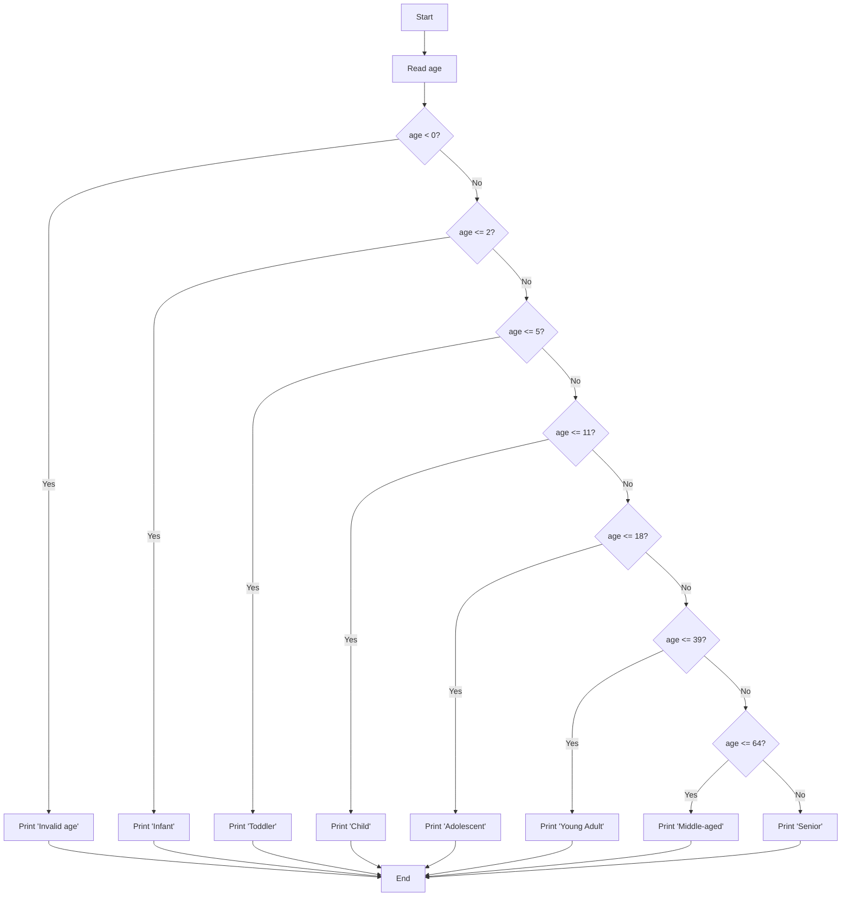

# Chapter 2: Decision Making with Conditionals

## Introduction

The programs you worked with in the introduction chapter were strictly sequential. Each program's statements were executed in sequence, starting from the beginning of the program and continuing, without interruption, to its end. While sequential execution of every statement in a program can be used to solve some small exercises, it is not sufficient to solve most interesting problems.

Decision making constructs allow programs to contain statements that may or may not be executed when the program runs. Execution still begins at the top of the program and progresses toward the bottom, but some statements that are present in the program may be skipped. This allows programs to perform different tasks for different input values and greatly increases the variety of problems that a Python program can solve.

## Python Data Types for Conditionals

### Boolean Type
The boolean type (`bool`) has only two values: `True` and `False`. These are used in conditional statements to make decisions.

```python
is_student = True
has_discount = False

if is_student:
    print("Student discount applied")
```

### None Type
The `None` type represents the absence of a value. It's often used as a default value or to indicate that a variable has no meaningful value yet.

```python
result = None

if result is None:
    print("No result available")
```

## 2.1 If Statements

Python programs make decisions using if statements. An if statement includes a condition and one or more statements that form the body of the if statement. When an if statement is executed, its condition is evaluated to determine whether or not the statements in its body will execute. If the condition evaluates to True then the body of the if statement executes, followed by the rest of the statements in the program. If the if statement's condition evaluates to False then the body of the if statement is skipped and execution continues at the first line after the body of the if statement.

The condition on an if statement can be an arbitrarily complex expression that evaluates to either True or False. Such an expression is called a Boolean expression, named after George Boole (1815–1864), who was a pioneer in formal logic. An if statement's condition often includes a relational operator that compares two values, variables or complex expressions. Python's relational operators are listed below.

| Relational Operator | Meaning |
|---|---|
| `<` | Less than |
| `<=` | Less than or equal to |
| `>` | Greater than |
| `>=` | Greater than or equal to |
| `==` | Equal to |
| `!=` | Not equal to |

The body of an if statement consists of one or more statements that must be indented more than the if keyword. It ends before the next line that is indented the same amount as (or less than) the if keyword. You can choose how many spaces to use when indenting the bodies of your if statements. All of the programs presented in this book use two spaces for indenting, but you can use one space, or several spaces, if your prefer.

### Example 1: Basic If Statement
```python
# Read a number from the user
num = float(input("Enter a number: "))

# Store the appropriate message in result
if num == 0:
  result = "The number was zero"
if num != 0:
  result = "The number was not zero"

# Display the message
print(result)
```

### Example 2: Even or Odd (Exercise 101)
```python
# Read an integer from the user
number = int(input("Enter a number: "))

# Check if even or odd
if number % 2 == 0:
    print("even")
else:
    print("odd")
```



## 2.2 If-Else Statements

The previous example stored one message into result when the number entered by the user was zero, and it stored a different message into result when the entered number was non-zero. More generally, the conditions on the if statements were constructed so that exactly one of the two if statement bodies would execute. There is no way for both bodies to execute and there is no way for neither body to execute. Such conditions are said to be mutually exclusive.

An if-else statement consists of an if part with a condition and a body, and an else part with a body (but no condition). When the statement executes its condition is evaluated. If the condition evaluates to True then the body of the if part executes and the body of the else part is skipped. When the condition evaluates to False the body of the if part is skipped and the body of the else part executes. It is impossible for both bodies to execute, and it is impossible to skip both bodies. As a result, an if-else statement can be used instead of two if statements when one if statement immediately follows the other and the conditions on the if statements are mutually exclusive.

### Example: If-Else Statement
```python
# Read a number from the user
num = float(input("Enter a number: "))

# Store the appropriate message in result
if num == 0:
  result = "The number was zero"
else:
  result = "The number was not zero"

# Display the message
print(result)
```

## 2.3 If-Elif-Else Statements

An if-elif-else statement is used to execute exactly one of several alternatives. The statement begins with an if part, followed by one or more elif parts, followed by an else part. All of these parts must include a body that is indented. Each of the if and elif parts must also include a condition that evaluates to either True or False.

### Syntax
```python
if condition1:
    # code block 1
elif condition2:
    # code block 2
elif condition3:
    # code block 3
else:
    # default code block
```

When an if-elif-else statement is executed the condition on the if part is evaluated first. If it evaluates to True then the body of the if part is executed and all of the elif and else parts are skipped. But if the if part's condition evaluates to False then its body is skipped and Python goes on and evaluates the condition on the first elif part. If this condition evaluates to True then the body of the first elif part executes and all of the remaining conditions and bodies are skipped. Otherwise Python continues by evaluating the condition on each elif part in sequence. This continues until a condition is found that evaluates to True. Then the body associated with that condition is executed and the remaining elif and else parts are skipped. If Python reaches the else part of the statement (because all of the conditions on the if and elif parts evaluated to False) then it executes the body of the else part.

### Example 1: Number Sign (Exercise 102)
```python
# Read a number from the user
num = int(input("Enter a number: "))

# Determine if positive, negative, or zero
if num > 0:
    print("positive")
elif num < 0:
    print("negative")
else:
    print("zero")
```



### Example 2: Grade Points (Exercise 117)
```python
# Read letter grade from user
grade = input("Enter letter grade: ")

# Convert to grade points
if grade == "A+" or grade == "A":
    print("4.0")
elif grade == "A-":
    print("3.7")
elif grade == "B+":
    print("3.3")
elif grade == "B":
    print("3.0")
elif grade == "B-":
    print("2.7")
elif grade == "C+":
    print("2.3")
elif grade == "C":
    print("2.0")
elif grade == "C-":
    print("1.7")
elif grade == "D+":
    print("1.3")
elif grade == "D":
    print("1.0")
elif grade == "F":
    print("0.0")
else:
    print("Invalid grade")
```



### Example 3: Triangle Classification (Exercise 107)
```python
# Read three sides of a triangle
side1 = float(input("Enter first side: "))
side2 = float(input("Enter second side: "))
side3 = float(input("Enter third side: "))

# Classify the triangle
if side1 == side2 == side3:
    print("equilateral")
elif side1 == side2 or side1 == side3 or side2 == side3:
    print("isosceles")
else:
    print("scalene")
```



### Example 4: Life Phases (Exercise 112)
```python
# Read age from user
age = int(input("Enter age: "))

# Determine life phase
if age < 0:
    print("Invalid age")
elif age <= 2:
    print("Infant")
elif age <= 5:
    print("Toddler")
elif age <= 11:
    print("Child")
elif age <= 18:
    print("Adolescent")
elif age <= 39:
    print("Young Adult")
elif age <= 64:
    print("Middle-aged")
else:
    print("Senior")
```



## 2.4 If-Elif Statements

The else that appears at the end of an if-elif-else statement is optional. When the else is present, the statement selects exactly one of several options. Omitting the else selects at most one of several options. When an if-elif statement is used, none of the bodies execute when all of the conditions evaluate to False. Whether one of the bodies executes, or not, the program will continue executing at the first statement after the body of the final elif part.

## 2.5 Nested If Statements

The body of any if part, elif part or else part of any type of if statement can contain (almost) any Python statement, including another if, if-else, if-elif or if-elif-else statement. When one if statement (of any type) appears in the body of another if statement (of any type) the if statements are said to be nested.

### Example: Nested If Statement
```python
# Read a number from the user
num = float(input("Enter a number: "))

# Store the appropriate message in result
if num > 0:
  # Determine what adjective should be used to describe the number
  adjective = " "
  if num >= 1000000:
    adjective = " really big "
  elif num >= 1000:
    adjective = " big "

  # Store the message for positive numbers including the appropriate adjective
  result = "That's a" + adjective + "positive number"
elif num < 0:
  result = "That's a negative number"
else:
  result = "That's zero"

# Display the message
print(result)
```

## 2.6 Boolean Logic

A Boolean expression is an expression that evaluates to either True or False. The expression can include a wide variety of elements such as the Boolean values True and False, variables containing Boolean values, relational operators, and calls to functions that return Boolean results. Boolean expressions can also include Boolean operators that combine and manipulate Boolean values. Python includes three Boolean operators: `not`, `and`, and `or`.

### The `not` Operator

The `not` operator reverses the truth of a Boolean expression. If the expression, x, which appears to the right of the not operator, evaluates to True then `not x` evaluates to False. If x evaluates to False then `not x` evaluates to True.

| x | not x |
|---|---|
| False | True |
| True | False |

### The `and` Operator

The `and` and `or` operators combine two Boolean values to compute a Boolean result. The Boolean expression `x and y` evaluates to True if x is True and y is also True. If x is False, or y is False, or both x and y are False then `x and y` evaluates to False.

| x | y | x and y |
|---|---|---|
| False | False | False |
| False | True | False |
| True | False | False |
| True | True | True |

### The `or` Operator

The Boolean expression `x or y` evaluates to True if x is True, or if y is True, or if both x and y are True. It only evaluates to False if both x and y are False.

| x | y | x or y |
|---|---|---|
| False | False | False |
| False | True | True |
| True | False | True |
| True | True | True |

### Example: Using Boolean Operators
```python
# Read an integer from the user
x = int(input("Enter an integer: "))

# Determine if it is one of the first 5 primes and report the result
if x == 2 or x == 3 or x == 5 or x == 7 or x == 11:
  print("That's one of the first 5 primes.")
else:
  print("That is not one of the first 5 primes.")
```

## Summary

Decision making constructs are essential for creating programs that can respond to different inputs and conditions. The key concepts covered in this chapter are:

- **If statements**: Execute code only when a condition is true
- **If-else statements**: Execute one of two code blocks based on a condition
- **If-elif-else statements**: Execute one of several code blocks based on multiple conditions
- **Nested if statements**: Place if statements inside other if statements for complex logic
- **Boolean operators**: Combine conditions using `and`, `or`, and `not`
- **Relational operators**: Compare values using `<`, `<=`, `>`, `>=`, `==`, and `!=`

These constructs allow you to create programs that make intelligent decisions and handle a wide variety of input scenarios.