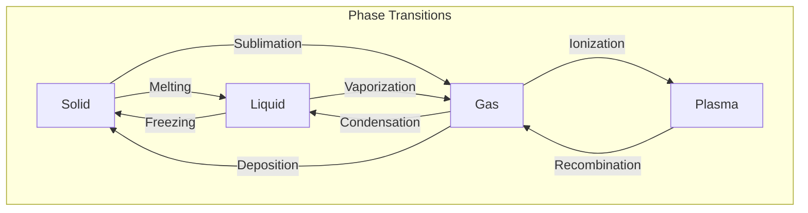

# Chemical Phase Transition

Write a program that determines the type of chemical phase transition based on the initial and final states of matter.

## Task

- Read the initial phase of matter from the user as a string
- Read the final phase of matter from the user as a string
- Display the name of the phase transition between the two states

## Phase Transitions Diagram



## Examples

**Example 1:**

```
liquid
solid
```
```
freezing
```

**Example 2:**
```
plasma
plasma
```
```
No transition
```

**Example 3:**
```
rock
water
```
```
Invalid phase
```

**Example 4:**
```
solid
plasma
```
```
Cannot transition directly
```

## Notes

- Input should be case-insensitive (handle "SOLID", "Liquid", "GAS", etc.)
- Valid phases are: solid, liquid, gas, plasma
- If the initial and final phases are the same, display `No transition`
- If either phase is invalid, display `Invalid phase`
- If the transition is not physically possible (e.g., solid to plasma), display `Cannot transition directly`
- Only the following transitions are possible:
    - Solid ↔ Liquid (melting/freezing)
    - Liquid ↔ Gas (vaporization/condensation)
    - Solid ↔ Gas (sublimation/deposition)
    - Gas ↔ Plasma (ionization/recombination)
