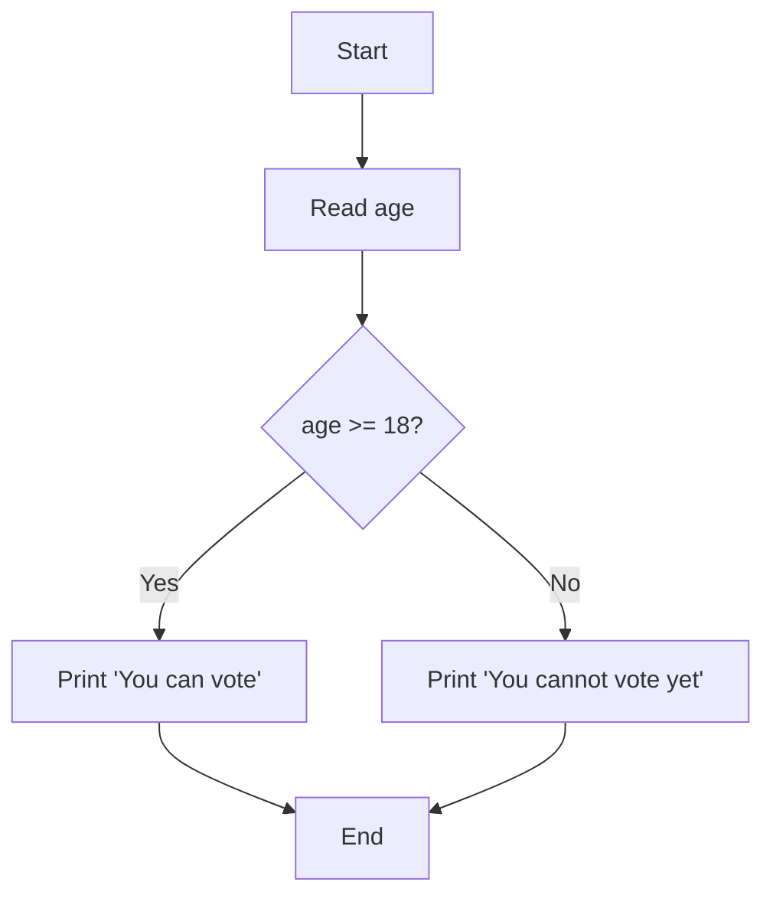
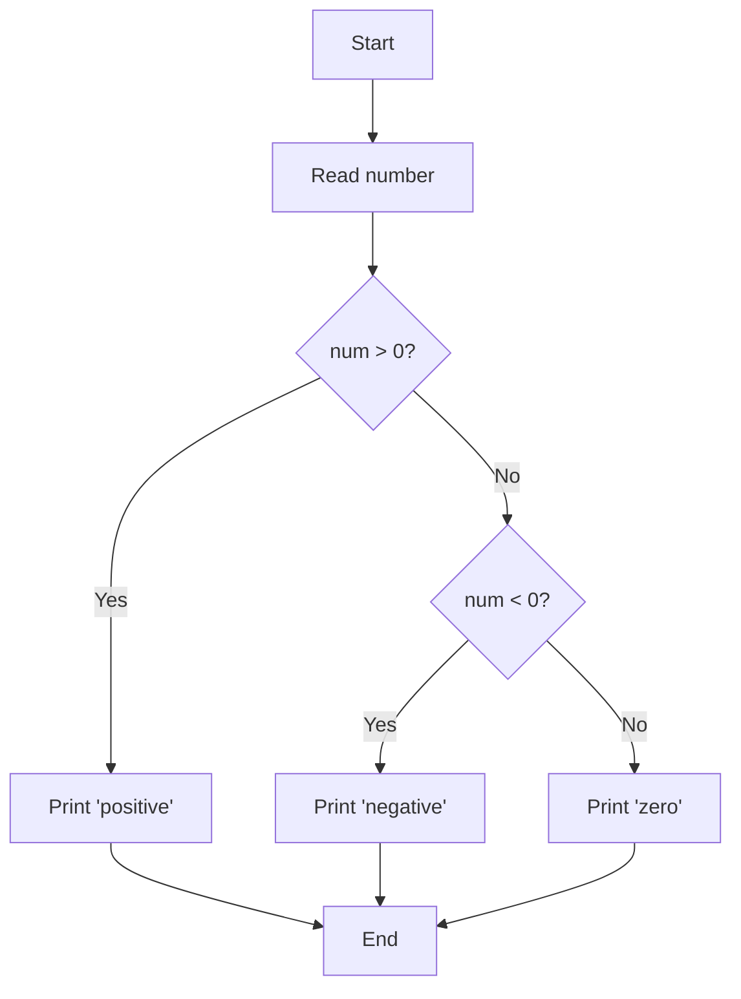
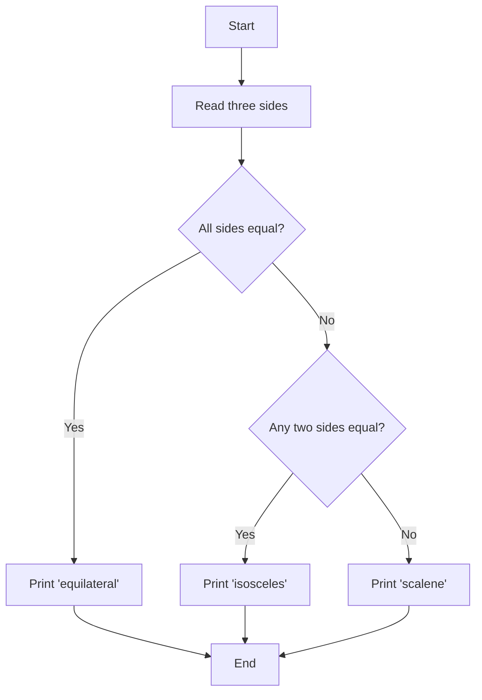

# Chapter 2: Decision Making with Conditionals

## Introduction

The programs you worked with in the introduction chapter were strictly sequential. Each program's statements were
executed in sequence, starting from the beginning of the program and continuing, without interruption, to its end. While
sequential execution of every statement in a program can be used to solve some small exercises, it is not sufficient to
solve the most interesting problems.

Decision making constructs allow programs to contain statements that may or may not be executed when the program runs.
Execution still begins at the top of the program and progresses toward the bottom, but some statements that are present
in the program may be skipped. This allows programs to perform different tasks for different input values and greatly
increases the variety of problems that a Python program can solve.

## Python Conditionals

## Examples

### Example 1: Can Vote

**Problem**: Determine if a person is eligible to vote based on their age (18 or older).

```python
# Read age from user
age = int(input("Enter your age: "))

# Check if eligible to vote
if age >= 18:
    print("You can vote")
else:
    print("You cannot vote yet")
```



### Example 2: Number Sign (Exercise 102)

**Problem**: Determine if a number is positive, negative, or zero.

```python
# Read a number from the user
num = int(input("Enter a number: "))

# Determine if positive, negative, or zero
if num > 0:
    print("positive")
elif num < 0:
    print("negative")
else:
    print("zero")
```



### Example 3: Triangle Classification (Exercise 107)

**Problem**: Classify a triangle as equilateral (all sides equal), isosceles (two sides equal), or scalene (no sides
equal) based on the lengths of its three sides.

```python
# Read three sides of a triangle
side1 = float(input("Enter first side: "))
side2 = float(input("Enter second side: "))
side3 = float(input("Enter third side: "))

# Classify the triangle
if side1 == side2 == side3:
    print("equilateral")
elif side1 == side2 or side1 == side3 or side2 == side3:
    print("isosceles")
else:
    print("scalene")
```



## Nested If Statements

The body of any `if` part, elif part or else part of any type of if statement can contain (almost) any Python statement,
including another if, if-else, if-elif or if-elif-else statement. When one if statement (of any type) appears in the
body of another `if` statement (of any type) the if statements are said to be nested.

### Example: Nested If Statement

```python
# Read a number from the user
num = float(input("Enter a number: "))

# Store the appropriate message in result
if num > 0:
    # Determine what adjective should be used to describe the number
    adjective = " "
    if num >= 1000000:
        adjective = " really big "
    elif num >= 1000:
        adjective = " big "

    # Store the message for positive numbers including the appropriate adjective
    result = "That's a" + adjective + "positive number"
elif num < 0:
    result = "That's a negative number"
else:
    result = "That's zero"

# Display the message
print(result)
```

## Summary

Decision making constructs are essential for creating programs that can respond to different inputs and conditions. The
key concepts covered in this chapter are:

- **If statements**: Execute code only when a condition is true
- **If-else statements**: Execute one of two code blocks based on a condition
- **If-elif-else statements**: Execute one of several code blocks based on multiple conditions
- **Nested if statements**: Place if statements inside other if statements for complex logic

These constructs allow you to create programs that make intelligent decisions and handle a wide variety of input
scenarios.
