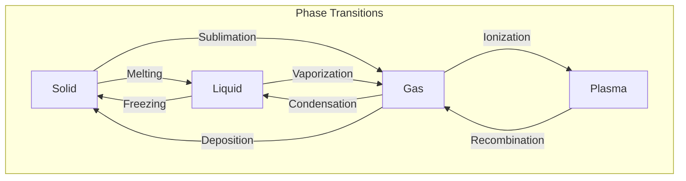

# Chemical Phase Transition

Write a program that determines the type of chemical phase transition based on the initial and final states of matter.

## Task

- Read the initial and final phases of matter from the user as strings
  (case-insensitive; valid phases are `solid`, `liquid`, `gas`, `plasma`)
- Display the transition name (see diagram) — or:
  - `No transition` if the initial and final phases are the same
  - `Cannot transition directly` if the transition is not physically
    possible (e.g. `solid` → `plasma`)

## Phase Transitions Diagram



## Examples

**Example 1:**

```
liquid
solid
```
```
freezing
```

**Example 2:**
```
plasma
plasma
```
```
No transition
```

**Example 3:**
```
solid
plasma
```
```
Cannot transition directly
```
