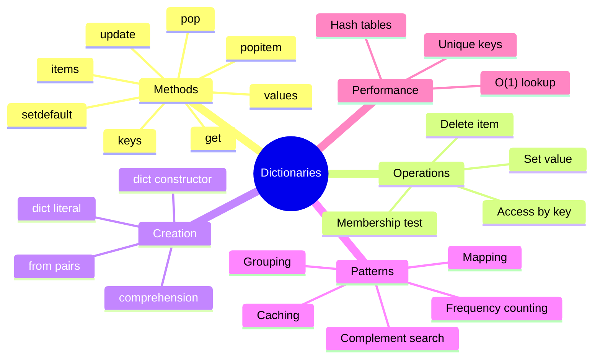

# Table of Contents

## Foundation Documentation

Read these in order before starting the exercises:

1. [Dictionary Basics](dict_basics.md) - Creating dictionaries, basic operations, when to use dictionaries
2. [Dictionary Operations](dict_operations.md) - Methods, iteration, comprehensions, merging
3. [Dictionary Best Practices](dict_best_practices.md) - Performance, common patterns, pitfalls

---

## Practice Exercises

### Beginner

1. [chars_count](../chars_count/chars_count.md)
2. [most_frequent_char](../most_frequent_char/most_frequent_char.md)
3. [first_unique_char](../first_unique_char/first_unique_char.md)

### Intermediate

**Encoding & Decoding:**

4. [read_aloud](../read_aloud/read_aloud.md)
5. [morse_encode](../morse_encode/morse_encode.md)
6. [morse_decode](../morse_decode/morse_decode.md)
7. [roman_to_int](../roman_to_int/roman_to_int.md)
8. [text_messaging](../text_messaging/text_messaging.md)

**Operations:**

9. [is_anagram](../is_anagram/is_anagram.md)
10. [is_phrase_anagram](../is_phrase_anagram/is_phrase_anagram.md)
11. [group_anagrams](../group_anagrams/group_anagrams.md)
12. [two_sum](../two_sum/two_sum.md)
13. [isomorphic_strings](../isomorphic_strings/isomorphic_strings.md)

### Advanced

14. [longest_substring_without_repeating](../longest_substring_without_repeating/longest_substring_without_repeating.md)
