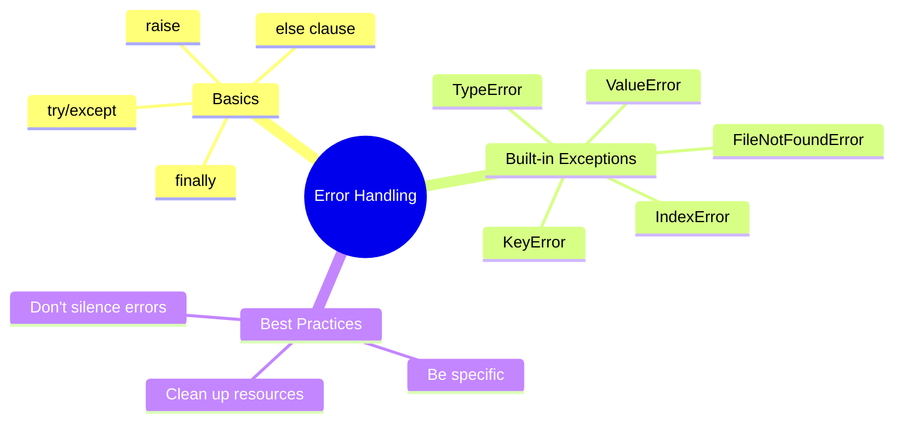

# Table of Contents

```mermaid
mindmap
    root((Error Handling))
        Basics
            try/except
            finally
            else clause
            raise
        Built-in Exceptions
            ValueError
            TypeError
            KeyError
            IndexError
            FileNotFoundError
        Best Practices
            Be specific
            Don't silence errors
            Clean up resources
```

## Recommended Reading Order

1. [`error_basics.md`](error_basics.md) - try/except, common exceptions, basic patterns
