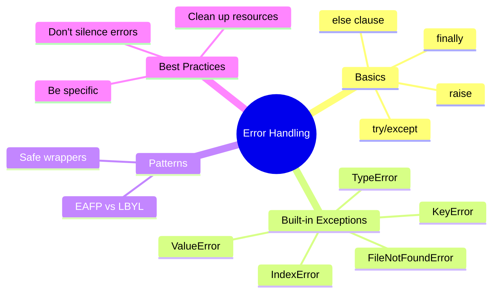

# Table of Contents

```mermaid
mindmap
    root((Error Handling))
        Basics
            try/except
            finally
            else clause
            raise
        Built-in Exceptions
            ValueError
            TypeError
            KeyError
            IndexError
            FileNotFoundError
        Patterns
            EAFP vs LBYL
            Safe wrappers
        Best Practices
            Be specific
            Don't silence errors
            Clean up resources
```

## Foundation Documentation

1. [Error Basics](error_basics.md) - try/except, common exceptions, basic patterns
