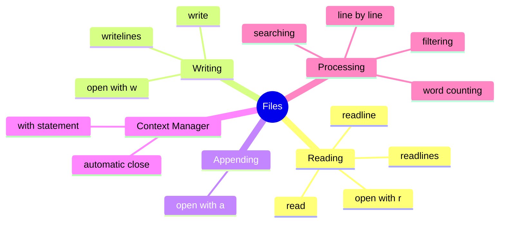

# Table of Contents

## Foundation Documentation

1. [`File Basics`](file_basics.md) - Opening, reading, writing, and context managers
1. [`UTF 8 encoding`](utf8_encoding.md)

## Practice Questions

### Beginner (Reading & Writing)

1. [`read_file_content`](../read_file_content/read_file_content.md) - Read entire file as string
1. [`count_lines`](../count_lines/count_lines.md) - Count number of lines
1. [`write_lines`](../write_lines/write_lines.md) - Write list of lines to file
1. [`append_line`](../append_line/append_line.md) - Append single line to file
1. [`head`](../head/head.md) - Return first n lines
1. [`tail`](../tail/tail.md) - Return last n lines

### Intermediate (Text Processing)

1. [`count_words`](../count_words/count_words.md) - Count total words in file
1. [`find_longest_word`](../find_longest_word/find_longest_word.md) - Find longest word
1. [`word_frequency`](../word_frequency/word_frequency.md) - Count word occurrences
1. [`search_lines`](../search_lines/search_lines.md) - Find lines containing search term
1. [`remove_blank_lines`](../remove_blank_lines/remove_blank_lines.md) - Copy file without blank lines
1. [`merge_files`](../merge_files/merge_files.md) - Merge multiple files into one
1. [`letter_frequency`](../letter_frequency/letter_frequency.md) - Count letter occurrences
1. [`remove_comments`](../remove_comments/remove_comments.md) - Strip Python comment lines
1. [`find_repeated_words`](../find_repeated_words/find_repeated_words.md) - Detect consecutive duplicates
1. [`six_vowel_words`](../six_vowel_words/six_vowel_words.md) - Find words with AEIOUY in order

### Advanced (Multi-file & Analysis)

1. [`spell_checker`](../spell_checker/spell_checker.md) - Check spelling against dictionary
1. [`redact_text`](../redact_text/redact_text.md) - Replace sensitive words with asterisks
1. [`find_missing_comments`](../find_missing_comments/find_missing_comments.md) - Find uncommented functions
1. [`element_lookup`](../element_lookup/element_lookup.md) - Look up chemical elements from data file
