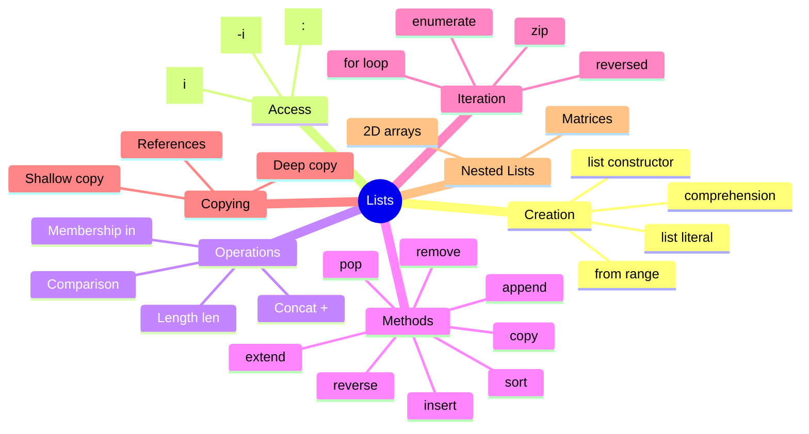

# Table of Contents

## Recommended Reading Order

1. [`list_basics.md`](list_basics.md) - Introduction, creating lists, and accessing elements
1. [`list_operations.md`](list_operations.md) - Operations and methods
1. [`join_iterable.md`](join_iterable.md) - Joining iterables to strings
1. [`list_iteration.md`](list_iteration.md) - Iteration patterns and common patterns
1. [`list_copying.md`](list_copying.md) - Copying concepts and methods
1. [`nested_lists.md`](nested_lists.md) - Nested lists (2D and 3D)
1. [`list_best_practices.md`](list_best_practices.md) - Common mistakes, best practices, and quick reference

## Practice Questions

1. [`str_to_ints`](../str_to_ints/str_to_ints.md)
1. [`list_to_string`](../list_to_string/list_to_string.md)
1. [`get_words`](../get_words/get_words.md)
1. [`reverse_list`](../reverse_list/reverse_list.md)
1. [`list_items`](../list_items/list_items.md)
1. [`list_total`](../list_total/list_total.md)
1. [`average`](../average/average.md)
1. [`two_list_operations`](../two_list_operations/two_list_operations.md)
1. [`remove_outliers`](../remove_outliers/remove_outliers.md)
1. [`sort_numbers`](../sort_numbers/sort_numbers.md)
1. [`binary_search`](../binary_search/binary_search.md)
1. [`slice`](../slice/slice.md)
1. [`copy_list`](../copy_list/copy_list.md)
1. [`merge_and_sort`](../merge_and_sort/merge_and_sort.md)
1. [`to3x3matrix`](../to3x3matrix/to3x3matrix.md)
1. [`to_matrix`](../to_matrix/to_matrix.md)
1. [`divisors`](../divisors/divisors.md)
1. [`is_perfect`](../is_perfect/is_perfect.md)
1. [`deck_operations`](../deck_operations/deck_operations.md)
1. [`deal_hands`](../deal_hands/deal_hands.md)
1. [`is_sublist`](../is_sublist/is_sublist.md)
1. [`sublists`](../sublists/sublists.md)
1. [`sieve_of_eratosthenes`](../sieve_of_eratosthenes/sieve_of_eratosthenes.md)
1. [`filter_function`](../filter_function/filter_function.md)
1. [`tokenize_expression`](../tokenize_expression/tokenize_expression.md)
1. [`mark_unary`](../mark_unary/mark_unary.md)
1. [`precedence`](../precedence/precedence.md)
1. [`infix_to_postfix`](../infix_to_postfix/infix_to_postfix.md)
1. [`evaluate_postfix`](../evaluate_postfix/evaluate_postfix.md)
