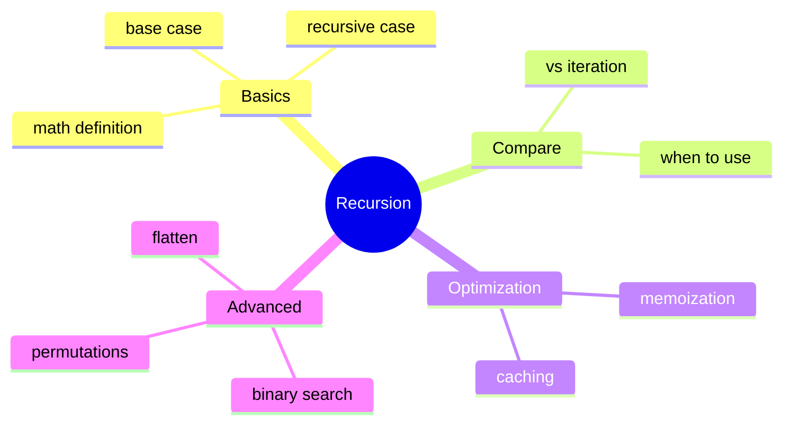

# Table of Contents

## Foundation Documentation

1. [`What is Recursion?`](what_is_recursion.md) - Math definition, first code
2. [`Base Case`](base_case.md) - Stopping condition
3. [`Examples`](examples.md) - Question → Solution format
4. [`Recursion vs Iteration`](recursion_vs_iteration.md) - Comparison
5. [`Memoization`](memoization.md) - Caching results
6. [`Advanced`](advanced.md) - Binary search, flatten, permutations

## Practice Questions

### Beginner

1. [`factorial`](../factorial/factorial.md) - Calculate n!
1. [`sum_to_n`](../sum_to_n/sum_to_n.md) - Sum from 1 to n
1. [`count_digits`](../count_digits/count_digits.md) - Count digits in number
1. [`sum_digits`](../sum_digits/sum_digits.md) - Sum digits of number

### Intermediate

1. [`power`](../power/power.md) - Calculate base^exponent
1. [`fibonacci`](../fibonacci/fibonacci.md) - Nth Fibonacci number
1. [`gcd`](../gcd/gcd.md) - Greatest common divisor

### Advanced

1. [`binary_search`](../binary_search/binary_search.md) - Search in sorted list
1. [`flatten_list`](../flatten_list/flatten_list.md) - Flatten nested lists
1. [`nested_sum`](../nested_sum/nested_sum.md) - Sum of nested list
1. [`edit_distance`](../edit_distance/edit_distance.md) - String edit distance (Levenshtein)
1. [`coin_sum`](../coin_sum/coin_sum.md) - Count ways to make change
1. [`element_spelling`](../element_spelling/element_spelling.md) - Spell words with element symbols
1. [`element_sequences`](../element_sequences/element_sequences.md) - Longest element chain game
1. [`run_length_encoding`](../run_length_encoding/run_length_encoding.md) - Compress strings
1. [`run_length_decoding`](../run_length_decoding/run_length_decoding.md) - Decompress strings
