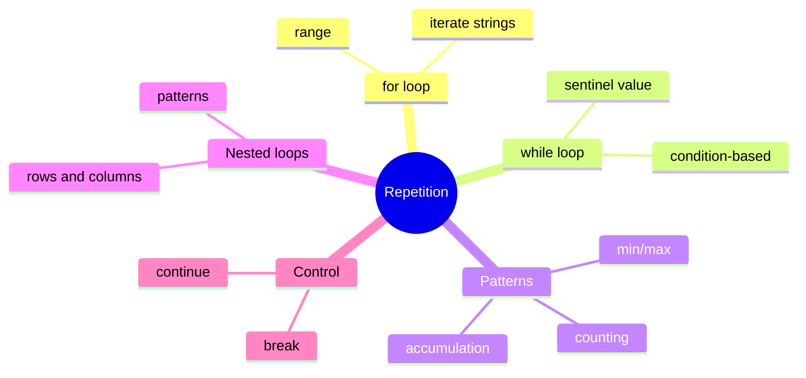

# Table of Contents

## Recommended Reading Order

1. [`repetitions.md`](repetitions.md)

## Practice Questions

1. [`right_triangle`](../right_triangle/right_triangle.md)
1. [`temperature_table`](../temperature_table/temperature_table.md)
1. [`arithmetic_sequence`](../arithmetic_sequence/arithmetic_sequence.md)
1. [`pyramid`](../pyramid/pyramid.md)
1. [`fizz_buzz`](../fizz_buzz/fizz_buzz.md)
1. [`number_triangle`](../number_triangle/number_triangle.md)
1. [`sum_table`](../sum_table/sum_table.md)
1. [`geometric_sequence`](../geometric_sequence/geometric_sequence.md)
1. [`multiplication_table`](../multiplication_table/multiplication_table.md)
1. [`average`](../average/average.md)
1. [`admission_price`](../admission_price/admission_price.md)
1. [`digit_sum`](../digit_sum/digit_sum.md)
1. [`number_of_digits`](../number_of_digits/number_of_digits.md)
1. [`vanilla_min_max`](../vanilla_min_max/vanilla_min_max.md)
1. [`number_pyramid`](../number_pyramid/number_pyramid.md)
1. [`palindrome`](../palindrome/palindrome.md)
1. [`collatz`](../collatz/collatz.md)
1. [`max_streak`](../max_streak/max_streak.md)
1. [`parity_bits`](../parity_bits/parity_bits.md)
1. [`no_pennies`](../no_pennies/no_pennies.md)
1. [`gcd`](../gcd/gcd.md)
1. [`binary_to_decimal`](../binary_to_decimal/binary_to_decimal.md)
1. [`decimal_to_binary`](../decimal_to_binary/decimal_to_binary.md)
1. [`multiword_palindrome`](../multiword_palindrome/multiword_palindrome.md)
1. [`guess_number`](../guess_number/guess_number.md)
1. [`caesar_cipher`](../caesar_cipher/caesar_cipher.md)
1. [`maximum_integer`](../maximum_integer/maximum_integer.md)
1. [`polygon_perimeter`](../polygon_perimeter/polygon_perimeter.md)
1. [`password_strength`](../password_strength/password_strength.md)
1. [`coin_flip`](../coin_flip/coin_flip.md)
1. [`square_root`](../square_root/square_root.md)
1. [`approximate_pi`](../approximate_pi/approximate_pi.md)
1. [`prime_factors`](../prime_factors/prime_factors.md)
