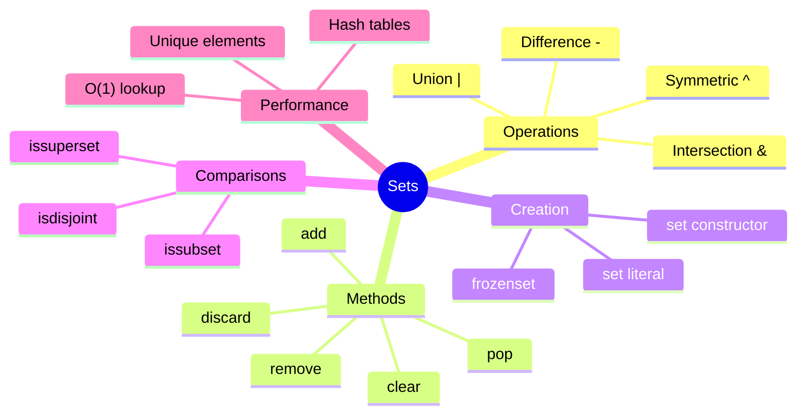

# Table of Contents

## Foundation Documentation

Read these in order before starting the exercises:

1. [Set Basics](set_basics.md) - Creating sets, basic operations, when to use sets
1. [Set Operations](set_operations.md) - Union, intersection, difference, symmetric difference
1. [Set Best Practices](set_best_practices.md) - Performance, common patterns, pitfalls

---

## Practice Exercises

### Beginner

1. [uniques](../uniques/uniques.md)
1. [list_union](../list_union/list_union.md)
1. [list_intersection](../list_intersection/list_intersection.md)
1. [subset_checker](../subset_checker/subset_checker.md)
1. [symmetric_difference](../symmetric_difference/symmetric_difference.md)

### Intermediate

1. [remove_duplicate_letters](../remove_duplicate_letters/remove_duplicate_letters.md)
1. [find_missing_numbers](../find_missing_numbers/find_missing_numbers.md)
1. [pangram_checker](../pangram_checker/pangram_checker.md)
1. [first_recurring_char](../first_recurring_char/first_recurring_char.md)

### Advanced

1. [longest_consecutive](../longest_consecutive/longest_consecutive.md)
