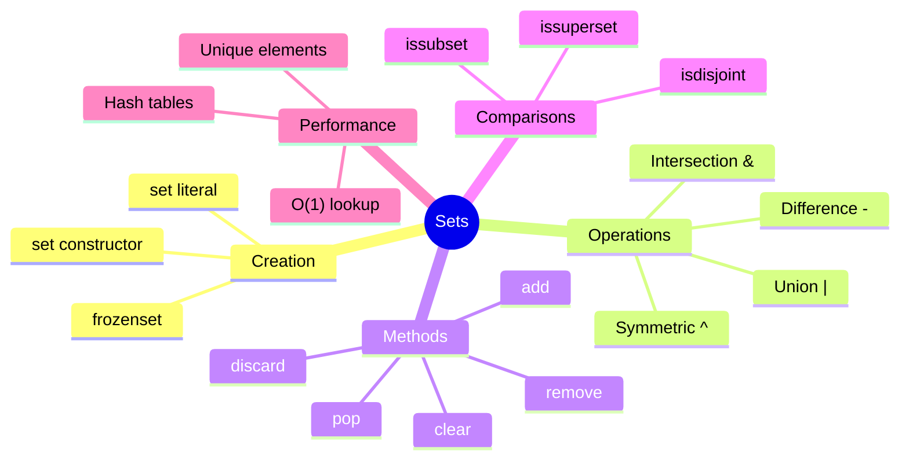

# Table of Contents

## Foundation Documentation

Read these in order before starting the exercises:

1. [Set Basics](set_basics.md) - Creating sets, basic operations, when to use sets
2. [Set Operations](set_operations.md) - Union, intersection, difference, symmetric difference
3. [Set Best Practices](set_best_practices.md) - Performance, common patterns, pitfalls

---

## Practice Exercises

### Beginner

| Exercise                                                                | Description                              |
|-------------------------------------------------------------------------|------------------------------------------|
| [uniques](../uniques/uniques.md)                                        | Extract unique elements from a list      |
| [list_union](../list_union/list_union.md)                               | Combine two lists without duplicates     |
| [list_intersection](../list_intersection/list_intersection.md)          | Find common elements between two lists   |
| [subset_checker](../subset_checker/subset_checker.md)                   | Check if one set is a subset of another  |
| [symmetric_difference](../symmetric_difference/symmetric_difference.md) | Find elements in either set but not both |

### Intermediate

| Exercise                                                                            | Description                                       |
|-------------------------------------------------------------------------------------|---------------------------------------------------|
| [remove_duplicate_letters](../remove_duplicate_letters/remove_duplicate_letters.md) | Remove duplicate characters from a string         |
| [find_missing_numbers](../find_missing_numbers/find_missing_numbers.md)             | Find missing numbers in a range                   |
| [pangram_checker](../pangram_checker/pangram_checker.md)                            | Check if a string contains all alphabet letters   |
| [first_recurring_char](../first_recurring_char/first_recurring_char.md)             | Find the first character that appears twice       |

### Advanced

| Exercise                                                             | Description                                     |
|----------------------------------------------------------------------|-------------------------------------------------|
| [longest_consecutive](../longest_consecutive/longest_consecutive.md) | Find the longest consecutive sequence in a list |
